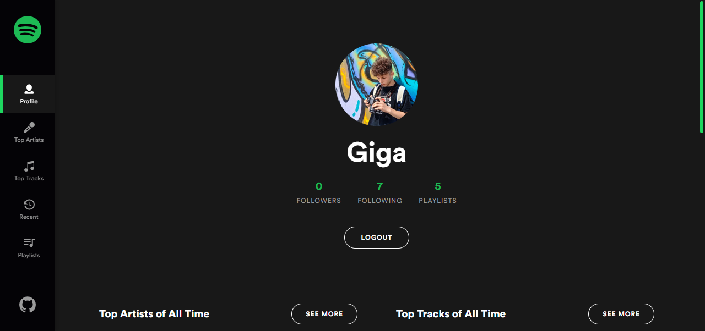
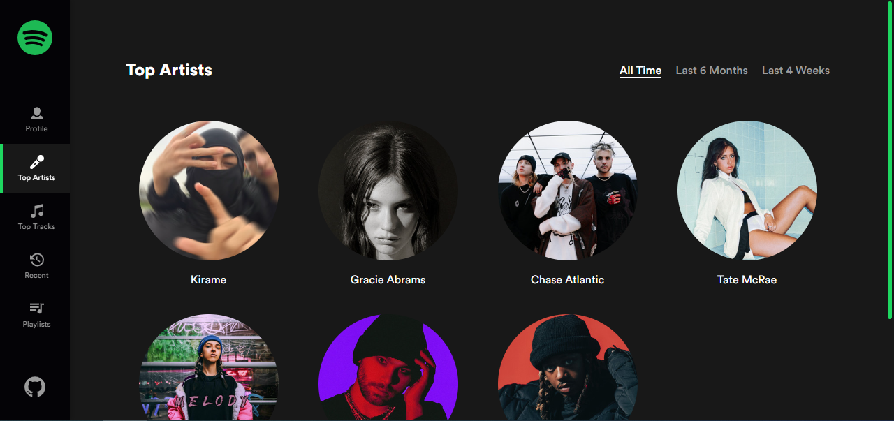
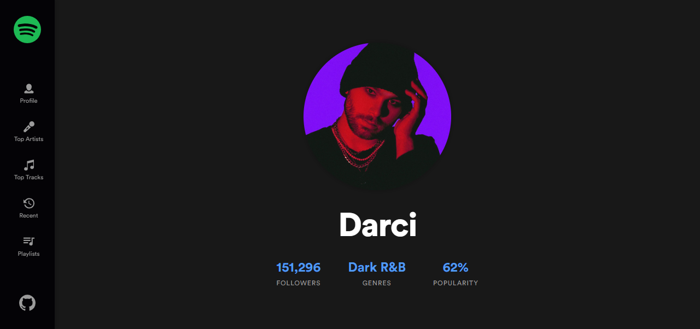
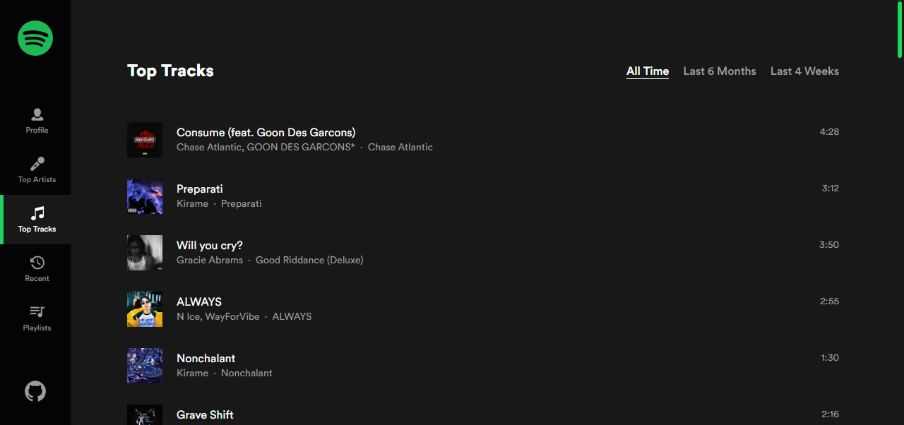
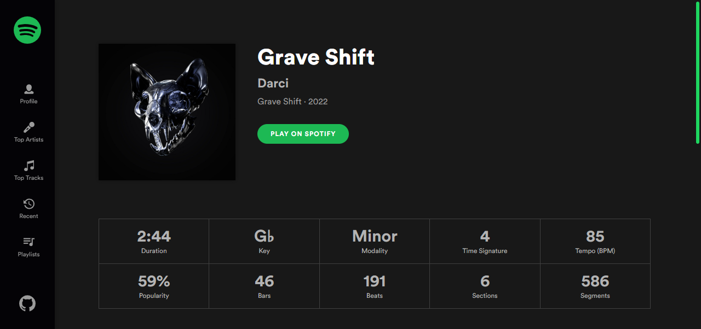
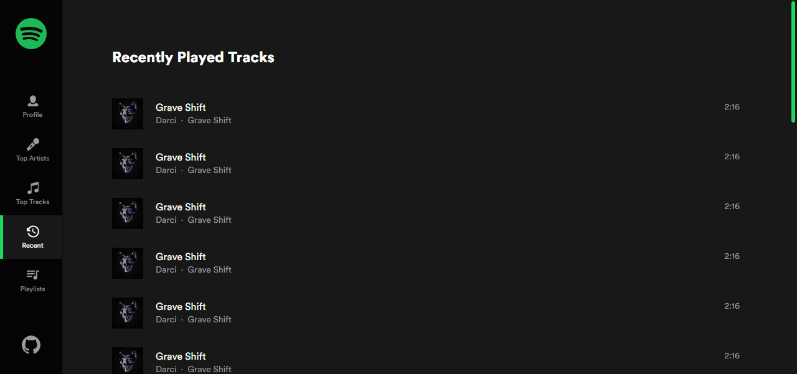
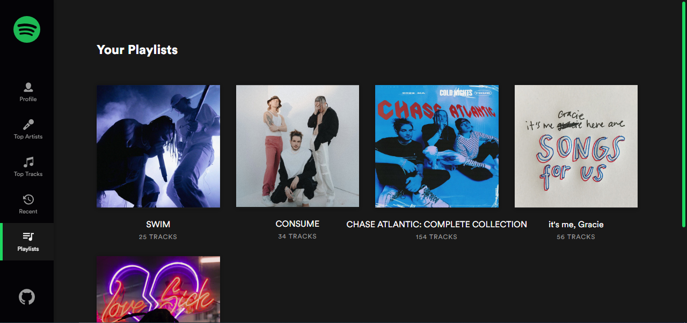
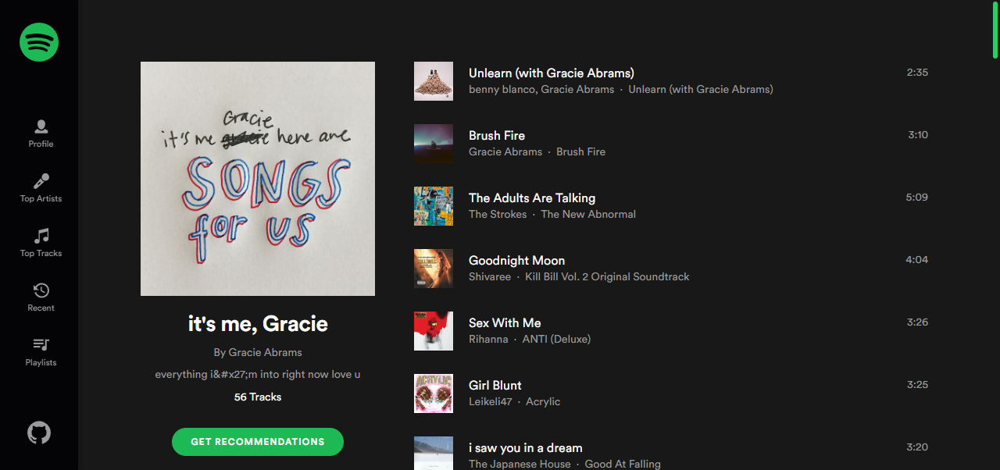
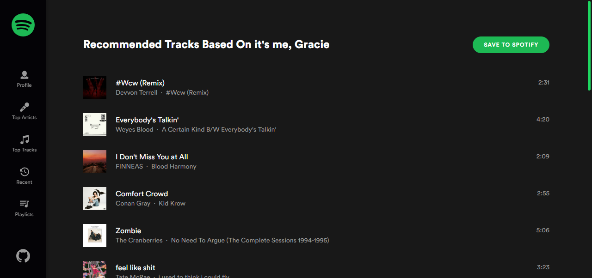

# Spotify Profile

> A web app for visualizing personalized Spotify data

Built with a bunch of things, but to name a few:

- [Spotify Web API](https://developer.spotify.com/documentation/web-api)
- [React](https://react.dev)
- [React Router Dom](https://reactrouter.com/en/main)
- [Styled Components](https://www.styled-components.com)
- [ChartJS](https://www.chartjs.org)
- [React ChartJS 2](https://react-chartjs-2.js.org)
- [Framer Motion](https://www.framer.com)
- [Axios](https://axios-http.com)

### App Preview

